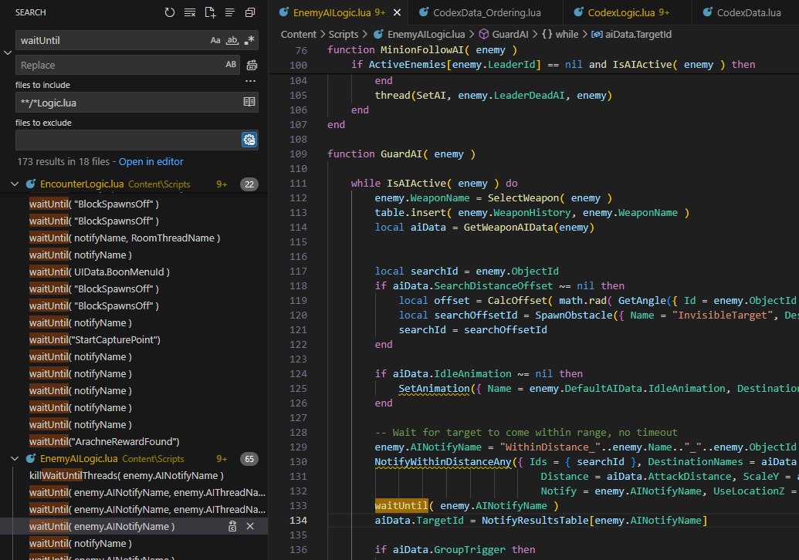

# Multithreaded modding

Any fun game has to deal with multiple jobs at the same time to provide a good experience. Hades 2 in particular plays Music and sound effects, moves enemies, reacts to the player's input, renders the beautiful scenery, manages game and run state and so on and so forth. For all this to work at the same time, the script and the engine run many functions in parallel. For example, the AI for every enemy gets its own thread to execute in.

<!-- truncate -->

On the lua scripting side of things (we don't know much about the engine) this is achieved using lua's built in coroutines. The difference between these coroutines and "real" multithreading is meaningful, but since it is neither relevant to this post's main point nor am I an expert on the topic I will just reference the lua docs on [coroutines vs. threads](https://www.lua.org/pil/9.4.html). Also, I will continue to call the asynchronous workers threads, because Supergiant Games chooses this name aswell in their `Main.lua` script.

## Waiting and resuming

Sometimes one of these threads has to wait for something to happen in another thread. This is where the capability for any thread to yield execution while the thing hasn't happened comes in handy. For example, some enemies stand still while the player character is not in range. The enemy AI thread just tells the program to give execution time to other threads until the player character is in range for the AI to start doing something.

Supergiant provides some very useful helper methods to manage these kinds of behaviours in their `Main.lua` script. In particular, the method `waitUntil()` is used to yield until a certain condition is met. When you do a quick search through the codebase, you will find many examples of this (not only the one I picked out for this post).



While looking at a few examples, you will notice that every call of this function has to provide some kind of special string. This string is the name of the signal that the thread is waiting for.

## Signal based processing

Signals are one method to handle reacting to things that happen. Many of you will also be familiar with events as a similar concept. The main difference here is that events are processed synchronously via callbacks and signals are processed asynchronously (for example by using different threads).

While some signals in Hades 2 are triggered by the engine, the game also has lua functions for triggering signals, namely `notify()` and `notifyExistingWaiters()` both in "Main.lua", which are used extensively (especially the latter). The first function registers that something, that can only happen once, has happened. This resumes all threads waiting for the signal and saves the information that this signal has been fired, so that future threads waiting for the signal can be resumed immediately. Despite this useful feature this function is used only very rarely throughout the scripts (and those uses are probably missed code updates, but I am not sure about this). The other function only continues currently waiting threads that a thing happened, which can happen multiple times.

## But why should I care?

Many modding tasks can be achieved by starting threads that wait for a certain signal. As an example, I will show you how to build a simple mod that prints a stoic quote every time a boon is obtained. To do this, I obtained quotes in a JSON file from [here](https://gist.github.com/miharekar/d57b58b017c457cd18062a1c36d82e02) and transformed them into a lua table with this quick and dirty python script:

```python
import json;

f = open("quotes.json", 'r', encoding="UTF-8")
content = f.read()
f.close()

data = json.loads(content)
quoteArray = data["quotes"]

f = open("quotes.lua", "w", encoding="UTF-8")
f.write("StoicQuotes = {\n")

for i in range(len(quoteArray)):
    pivot = quoteArray[i]
    text = str.replace(pivot["text"], "\"", "\\\"")
    author = str.replace(pivot["author"], "\"", "\\\"")
    f.write(f"    {{\n        Quote = \042{text}\042,\n        Author = \042{author}\042\n    }},\n")

f.write("}")
f.close()
```

## Building a little example mod

### Setting up

For this mod I use the [Hades 2 Mod Template](https://github.com/SGG-Modding/Hades2ModTemplate). After cloning (or downloading), we just make one little adjustment. We want every global (or mod-local) variable to be PascalCased. For example, line 28 in `main.lua` becomes `ModUtil = mods['SGG_Modding-ModUtil']` instead of `modutil = mods['SGG_Modding-ModUtil']`. Now the `quotes.lua` file has to be copied into the `src/` folder of the mod. After that, the quotes can be imported in `main.lua` like this:

**`main.lua`**

```lua
...
local function on_ready()
    -- what to do when we are ready, but not re-do on reload.
    if Config.Enabled == false then return end

    import 'ready.lua'
    import 'quotes.lua'
end
...
```

### Hooking into the reward spawning

Next, we need to know when a reward gets spawned, so that we can start listening to the signal indicating that the boon choice is finished. After a bit of searching, I found the function `SpawnRoomReward()` in `RewardLogic.lua`. This function creates the reward and returns it. Thus, we can get access to the properties of the reward. One of these properties indicates whether the reward is associated with a menu to choose upgrade options from. If it is, the menu will fire a signal when it is closed and the choice has benn made. This is exactly when we want to display our quotes.

We set up the hook like this:

**`ready.lua`**

```lua
---@meta _
-- globals we define are private to our plugin!
---@diagnostic disable: lowercase-global

-- here is where your mod sets up all the things it will do.
-- this file will not be reloaded if it changes during gameplay
-- 	so you will most likely want to have it reference
--	values and functions later defined in `reload.lua`.

ModUtil.mod.Path.Wrap("SpawnRoomReward", function(base, event, source)
	return patch_SpawnRoomReward(base, event, source)
end)
```

We implement the function like this:

**`reload.lua`**

```lua
function patch_SpawnRoomReward(base, event, source)
	local reward = base(event, source)

	if reward ~= nil and reward.MenuNotify ~= nil then
		thread(waitingPrinter, Game.UIData.BoonMenuId)
	end

	return reward
end

function waitingPrinter(signalName)
	waitUntil(signalName)
end
```

Now we spawn a thread every time a reward with an associated boon menu is spawned. This thread waits for the close signal of the menu but does not do anything after that. We change that in the next step.

### Displaying a random quote

There is a useful function for displaying text near a unit named `InCombatText()` which can be found in `CombatPresentation.lua`. This function needs the object ID of a unit, some text to display and a display duration. We choose a random quote and build a string to display from it (pasting newlines at some places to prevent text overflow), take the object ID from the `Hero` object and display the quote for 15 seconds.

**`reload.lua`**

```lua
...
function waitingPrinter(signalName)
	waitUntil(signalName)
	local quote = GetRandomValue(StoicQuotes)
	local spaceChars = 0
	local quoteText = quote.Quote:gsub("%s", function(c)
		spaceChars = spaceChars + 1
		if spaceChars == 10 then
			spaceChars = 0
			return "\n"
		end
		return c
	end)
	local toPrint = "\"" .. quoteText .. "\" - " .. quote.Author
	InCombatText(Game.CurrentRun.Hero.ObjectId, toPrint, 15)
end
```

### Tagging threads for easy deletion

Since all threads are saved in a table in the `Main.lua` script of the game, we should clean up the threads that didn't trigger when they can't trigger anymore. In this example a quote cannot be printed anymore when the room is left without (for whatever reason) picking up the boon. There is built-in functionality for this once again with the function `killTaggedThreads()` in `Main.lua`.

Every thread that calls `waitUntil()` can provide an optional tag name as the second argument. This way, the thread can be killed via calling `killTaggedThreads()` at any point with the chosen tag name. We can use this in a hook for the `LeaveRoom()` function from `RoomLogic.lua` to dispose of the threads that didn't trigger.

Setting the additional hook:

**`ready.lua`**

```lua
...
ModUtil.mod.Path.Wrap("LeaveRoom", function(base, currentRun, door)
	return patch_LeaveRoom(base, currentRun, door)
end)
```

Implementing tag name and desctruction:

**`reload.lua`**

```lua
...
function waitingPrinter(signalName)
	waitUntil(signalName, "Siuhnexus-StoicQuotes-QuotePrinter")
	...
end

function patch_LeaveRoom(base, currentRun, door)
	killTaggedThreads("Siuhnexus-StoicQuotes-QuotePrinter")
	base(currentRun, door)
end
```

Since every tag name has to play nice with the game tags and other mods, it is best practice to prefix every custom tag with your creator name and your mod name. You can write a convenience function in larger projects like this:

**`reload.lua`**

```lua
function prefixTag(tagName)
	return "Siuhnexus-StoicQuotes-"..tagName
end
...
function waitingPrinter(signalName)
	waitUntil(signalName, prefixTag("QuotePrinter"))
	...
end

function patch_LeaveRoom(base, currentRun, door)
	killTaggedThreads(prefixTag("QuotePrinter"))
	base(currentRun, door)
end
```

### Dispatching custom signals

With this system, you can even allow other mods to react to your quotes being printed. Just dispatch a custom signal (prefixed to play nice):

**`reload.lua`**

```lua
function prefixTag(tagName)
	return "Siuhnexus-StoicQuotes-"..tagName
end
function prefixSignal(signalName)
	return "Siuhnexus-StoicQuotes-"..signalName
end
...
function waitingPrinter(signalName)
	...
	notifyExistingWaiters(prefixSignal("QuotePrinted"))
end
```

## A real-world example

The reason for me knowing about this and being very excited about it is my first little dabble into Hades 2 modding. I was looking for some fun mods and came across "MultiReward" by "abevol" on Thunderstore. This mod lets you spawn multiple copies of any room reward and lifts the maximum god restriction to let you experience what the full support of Olympus would be like. This is very fun, but the old way of spawning the boon had its limitations. Since rewards were spawned in a loop all at the same location and time, the screen was full of glow effects when spawning many boons, making it hard to see the god icon. Also, the bow in the fields of mourning pinged once for every spawned reward, which was annoying. Caged rewards could be obtained before clearing the encounter since every cage is associated with only one reward aswell.

This problem could be resolved by firing a custom signal in a very cautious `OnUsed` engine hook and spawning a thread in `SpawnRoomReward()` which reacted to the custom event. This spawns the rewards one after another without blocking the game logic and was exactly what I was looking for. If you are interested in the details, just check out the [source code](https://github.com/abevol/MultiReward).

## Final notes

Thank you for making it this far! I hope you are as excited about the potential of this concept as I am. I am looking forward to seeing what you can build with this.
