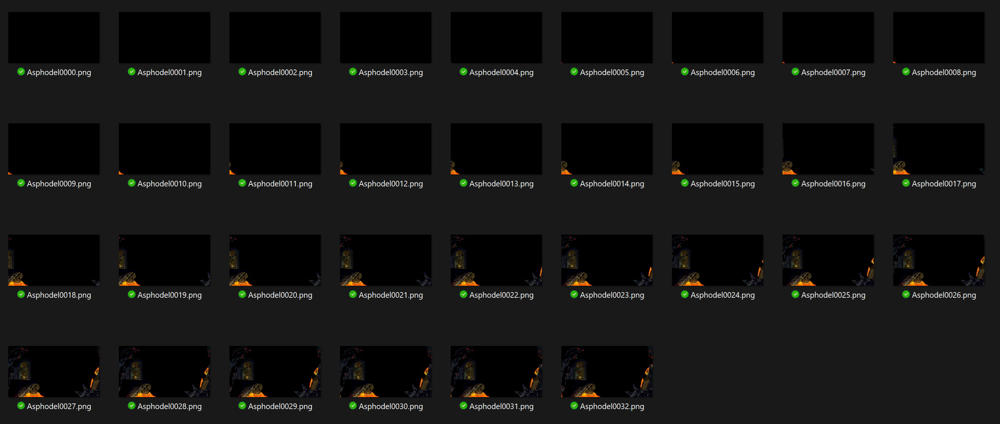
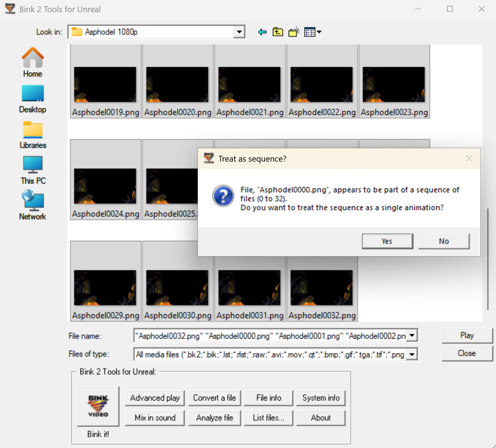
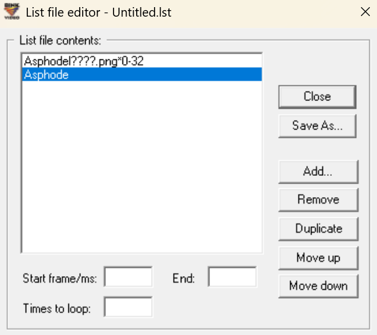
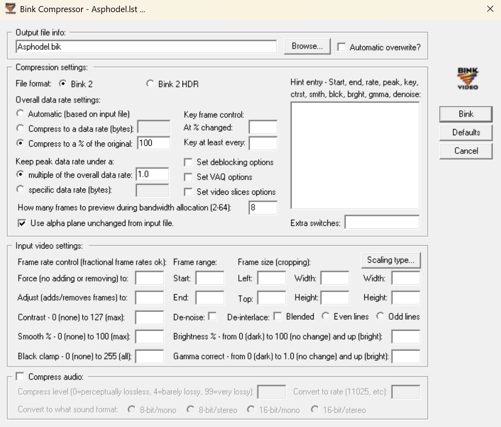
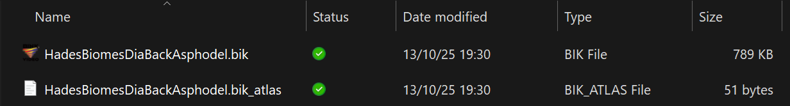
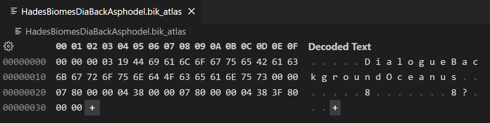
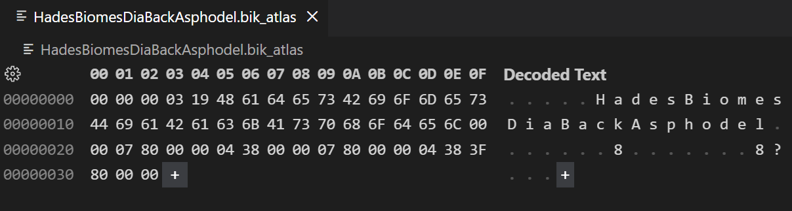

# Bink animations & video

Learn how to use the Bink video format to add animations to Hades II.

---

:::info[Install the required tools]
Make sure you have followed the [prerequisites](./prerequisites.md) page to install the necessary tools before proceeding.
:::

:::info[BinkFixTutorial]
The initial sections of this guide were adapted from [EtchJetty/Girl Bowser's BinkFixTutorial](https://github.com/EtchJetty/BinkFixTutorial) for Hades, which focused on *replacing* existing bink animations. Anything from the [Preparing the .bik_atlas](#preparing-the-bik_atlas) section onwards is new and required specifically if you are adding a *new* bink animation, both to Hades and Hades II.
:::

Bink video files were the basis of all character and enemy animations in Hades, and were also used for full-screen videos (such as the into/outro videos or the main menu background).
In Hades II's engine, bink files are supported in the same way, for both animations and videos, though they are only used for videos anymore.

## Before we start

Before we continue, please take note of a couple of important pieces of information regarding this guide:

- As we are limited to using bink files, there currently is **no way to add new animations to existing characters or enemies** in Hades II, as these use 3D models and animations. You can only add new characters or full-screen videos (unless you figure out a way to blend between the 3D and 2D animation systems).
- To add a new animation or video, there needs to be any existing bink animation/video **with the same resolution** already in Hades (if you own the game) or Hades II. Adding animations with different resolutions might be possible with a lot of work, but has not been done yet and won't be covered in the guide.
- The guide will **not** include any information on how to create models or animations to be converted into the bink format, only how to transform a `.png` sequence into a `.bik` file, and how to use this in the game. The [BinkFixTutorial](https://github.com/EtchJetty/BinkFixTutorial#video-creation) contains a section on creating a source animation.
- The guide will not go in-depth on the `.bik` file format itself, and only cover the basic usage through RAD Video Tools.
- In general, the guide will be very light-weight, and heavily reference [EtchJetty/Girl Bowser's BinkFixTutorial](https://github.com/EtchJetty/BinkFixTutorial) for Hades, as there is likely going to be very low demand for adding new bink animations to Hades II. Please reach out in the [Hades II Modding Discord](https://discord.gg/KuMbyrN) if you have any questions or suggestions!

For this guide, we'll use the example of a new full-screen video, which can be used as a dialogue background animation in Hades II.
Character animations work the same way, but will require additional work on the `sjson` side of things, which is not covered in this guide - the best reference material for this is the Hades (first game) code itself, which used bink animations for all characters and enemies.

## Setting up your .png sequence

:::info[Familiar with the BinkFixTutorial?]
If you're already familiar with the BinkFixTutorial, you can directly skip to the [Preparing the .bik_atlas](./bink.md#preparing-the-bik_atlas) section, as this was not covered in that guide and is required to use new bink files in the game.
:::

The basis of any bink animation is a sequence of `.png` images, each representing one frame of the animation.
These can be with or without transparency, depending on your needs.

:::warning[Resolution]
You can only add bink animations or videos with resolutions of an existing bink file used in either Hades or Hades II. For full-screen videos this is easy (1920x1080 or 1280x720), but for character animations you will need to find an existing animation with the same resolution as your desired one.
:::

For our use case, we have created the following sequence of images:



It's a good idea to name the files with a common suffix containing the frame number, which will make generating the `.bik` file easier later on.

:::info[Manipulating the bink through sjson]
Remember that you have a lot of tools available to modify the resulting bink file though sjson in the game, such as reverse playback, playback speed, setting custom start and end frames, etc. This way, you don't need to create multiple animation files for these effects.
:::

## Generating the .bik file

With your `.png` sequence ready, you can now generate the `.bik` file using the `RAD Video Tools`.

1. Open `RAD Video Tools` and navigate to the folder containing your `.png` sequence.
2. Select all image in the sequence at once.
3. Click `List files...` in the toolbar at the bottom.
4. Select `Yes` when prompted if you would like to treat the sequence as a single animation.



5. In the new window, you may see items in the list that do not match the pattern (`Asphode` in the example) - they might not matter, but it's best to `Remove` these. Afterwards, click `Close`.



6. Select `Yes` when prompted if you would like to save the changed list file.
7. Save the `.lst` file in the same folder as your `.png` sequence, the name does not matter.
8. In the main `RAD Video Tools` window, select the newly created `.lst` file and click `Bink it!` in the toolbar at the bottom.
9. You'll be presented with a bunch of options. Most of these are irrelevant, but make sure to change/set the following:
   - Change the file ending at the top from `.bk2` to `.bik` - Hades II uses the Bink 1 format, not Bink 2.
   - Make sure that the `File format` is set to `Bink 2`, not `Bink 2 HDR`.
   - Make sure that the `Overall data rate setting` is set to `Compress to a % of the original:`, with a value of `100%`.
   - If your movie has transparency, ensure that the alpha plane setting at the bottom of the `Compression settings` section is set to `Use alpha plane unchanged from input file`.
   - You can uncheck `Compress audio`, as Hades II does not use this.



10. Your settings should look similar to the screenshot above. Then, click `Bink` to generate the `.bik` file.
11. You should now have the `.bik` file in the same folder as your `.png` sequence. Selecting it and clicking `Play` in `RAD Video Tools` should open the animation and play it.

## Preparing the .bik_atlas

Before you can use your new bink file in the game, you need to create a fitting `.bik_atlas` file for it, which contains important metadata, such as the resolution, about the `.bik` file.
There is no way of generating a new `.bik_atlas` from scratch, so we need to copy and reuse an existing one - this is why we can only add bink files with resolutions already present in Hades or Hades II, as the resolution is stored in the `.bik_atlas` file, but cannot be changed (at least we have not yet found a way to do so).

Let's grab an existing `.bik_atlas` file from Hades II, since we're adding a new full-screen video, we can use one of the existing dialogue background animations from `Content/Movies/1080p`, e.g. `DialogueBackgroundOceanus.bik_atlas`.

:::warning[Filename character length]
Another limitation of this process is that your new bink file and it's atlas file need to have filenames with the same character length as the existing atlas you are copying from. For example, `DialogueBackgroundOceanus.bik` has 26 characters (without the file ending), so your new bink file also needs to have 26 characters in its name.
:::

As the atlas we copied has 26 characters, we'll name the `.bik` file we created earlier `HadesBiomesDiaBackAsphodel.bik` to match this requirement, and also try to have a unique name (so we don't end up accidentally clashing with any other mods).

You should now have a `.bik` and `.bik_atlas` file with the same names in your folder:



For the last step, we'll need to open the `.bik_atlas` file in a Hex Editor (e.g. by using the Hex Editor extension for VS Code).
Depending on your atlas, this will look similar to the following:



You'll see that the filename of the original atlas is stored in the middle of the file here (`DialogueBackgroundOceanus`) - we'll need to change this to the name of our new bink file (`HadesBiomesDiaBackAsphodel`). Make sure to only remove the characters belonging to the filename, and not any before or after it, then insert the new name:



## Using the new animation in Hades II

After creating the new `.bik` and `.bik_atlas` files, you'll need to add them to the corresponding `Content/Movies` folder (either `1080p` or `720p`, depending on the resolution you used) in the Hades II installation.
Bink files cannot be loaded from your `plugins_data` directly, so you'll need to copy them over during installation of your mod.

Now, all you need to do is to create the necessary `sjson` entries to define the new animations using the new bink file.
In our example, these look like this, to create `In` and `Out` dialogue background animations:

```sjson
{
  Name = "ModsNikkelMHadesBiomes_DialogueBackground_Asphodel_In"
  Scale = 1
  FilePath = "NikkelM-HadesBiomesGUIModded\GUIModded\Screens\DialogueBackgrounds\DialogueBackgroundAsphodel"
  VideoTexture = "HadesBiomesDiaBackAsphodel"
  NumFrames = 32
  StartFrame = 1
  EndFrame = 32
  HoldLastFrame = false
  FlipHorizontal = true
  Loop = false
  PlaySpeed = 50
  Material = "Unlit"
  ChainTo = "ModsNikkelMHadesBiomes_DialogueBackground_Asphodel"
}
{
  Name = "ModsNikkelMHadesBiomes_DialogueBackground_Asphodel"
  InheritFrom = "ModsNikkelMHadesBiomes_DialogueBackground_Asphodel_In"
  NumFrames = 1
  Duration = 2
  FlipHorizontal = true
  Loop = true
  FilePath = "NikkelM-HadesBiomesGUIModded\GUIModded\Screens\DialogueBackgrounds\DialogueBackgroundAsphodel"
  ChainTo = "null"
}
{
  Name = "ModsNikkelMHadesBiomes_DialogueBackground_Asphodel_Out"
  InheritFrom = "ModsNikkelMHadesBiomes_DialogueBackground_Asphodel_In"
  PlaySpeed = 60
  FlipHorizontal = true
  PlayBackwards = true
  ChainTo = "null"
}
```

Note that the `VideoTexture` property needs to match the name of your new bink file (without the `.bik` ending).
In our example, there is an additional static texture that is equal to the last frame of the animation stored in the `FilePath` property - this is used to hold the animation while the dialogue is ongoing.

In the game, these animations could be referenced as such:

```lua
RoomData.BaseAsphodel = {
  NarrativeContextArt = "ModsNikkelMHadesBiomes_DialogueBackground_Asphodel",
}
```

The `_In` and `_Out` suffixes are automatically appended by the game - there may be similar conventions for other types of animations as well.

---

Go to `7:50` in the following video to see an example of such a new dialogue background animation in action - for Tartarus during a conversation with the Furies in this case, which uses the same technique as for Asphodel shown in this guide:

<!-- Always 16:9 with 100% width -->
<div style={{position: 'relative', paddingBottom: '56.25%', height: 0, overflow: 'hidden'}}>
  <iframe 
    style={{position: 'absolute', top: 0, left: 0, width: '100%', height: '100%'}}
    src="https://www.youtube.com/embed/T922uSZSqRE" 
    title="Hades II Modding Guide - Bink Video example"
    frameBorder="0" 
    allowFullScreen>
  </iframe>
</div>
