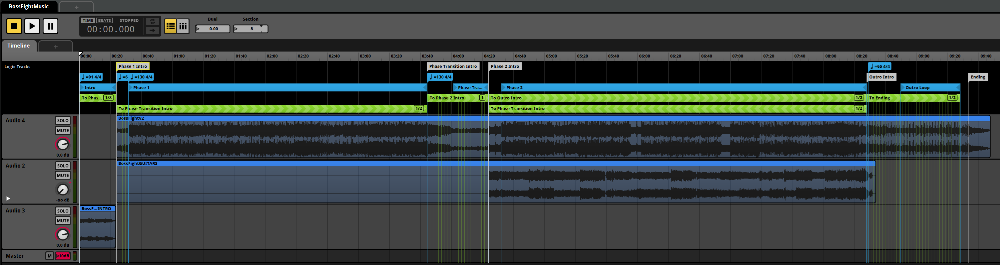
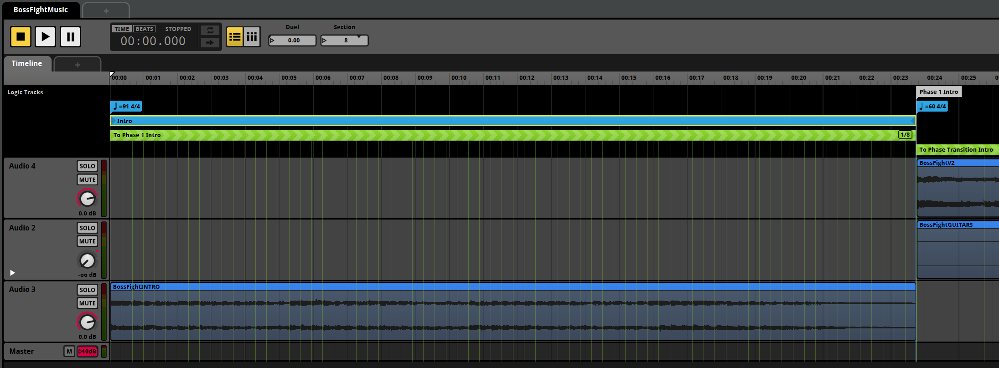
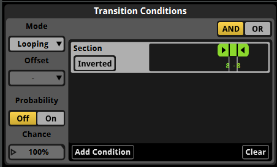
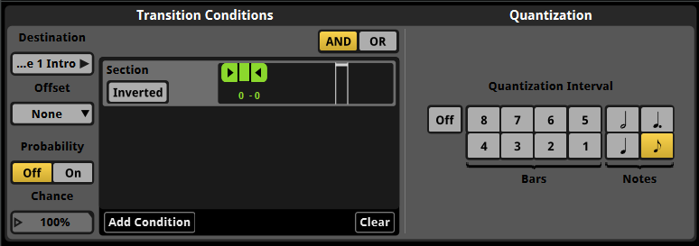
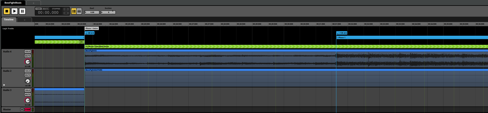

# Adding Dynamic Music

Learn how to dynamically adjust music sections in the game.

---

This guide will teach you how to use regions, markers and transitions in FMOD Studio to allow you to use the `Section` `SoundCueValue` in Hades II to dynamically switch between different parts of a single event during gameplay.

:::info[Follow the general music guide first]
Before continuing to read this guide, make sure you have read and understood the [Adding Sounds & Music](./adding-sounds-music.md) and the [Adding Multi-Track Music](./adding-multitrack-music.md) guides, as this guide builds on that knowledge.
:::

:::warning[Advanced Guide]
Be aware that this is a very advanced guide, and is not necessary knowledge for most audio mods, only when you want to e.g. add new biome or boss themes.
:::

## What is the `MusicSection` system?

If you read through the game's code, and especially if you are focused on audio-related code, you will notice the `MusicSection` key in many tables, such as for rooms, as well as the `SetMusicSection(section)` function call.
These music sections are used to quickly transition between different parts of a track, or to control which part of a track loops, among other things.

For example, in boss fights, there might be a section playing in the background of the introductory dialogue, which then transitions to the main fight theme, which itself loops until the boss is defeated, at which point it transitions to an outro section.
Or, whithin a region, there will be different themes for combat and non-combat situations.
Since these sections are completely different styles, this difference cannot be achieved by simply muting/unmuting stems as in the multi-track music system.
And using separate sections within the single event allows for smooth transitions between these parts at any point - since you never know exactly when a player will enter combat, for example.

Under the hood, the music section system is just another sound cue/property (as we've learned about in the [Adding Multi-Track Music](./adding-multitrack-music.md) guide), called `Section`, that is set to the given value within `SetMusicSection()`:

```lua
SetSoundCueValue({ Names = { "Section", }, Id = musicId, Value = section })
```

However, the way it is used is entirely different, as described above.

## Creating Dynamic Music for the Hades Boss Fight

To illustrate the process of creating dynamic music using the `Section` sound cue, we will re-create the boss fight music for Hades from the first game (you can listen to the track on [YouTube](https://www.youtube.com/watch?v=cVukkhUI-xM), but it does not have the intro section).
If you know how to use FMOD Bank Tools (see the [Prerequisites guide](./prerequisites.md) for a download link), you can get the original tracks (see the below names) from Hades' `Sounds.bank` file.
Otherwise, feel free to follow along this guide using a track of your choice that has multiple sections you want to transition between.

The below screenshot shows the final setup we will be creating in this guide, refer back to it as needed:



There are two videos linked at the bottom of this guide, one showing how this dynamic setup looks like on the event when the game changes the `Section` sound cue, and one showing the in-game implementation of this music event.

### Setup

We will start by importing the main fight music (`BossFightV2`), a secondary track for Hades' third phase (`BossFightGUITARS`), as well as an intro track (`BossFightINTRO`).
The intro track could also have been part of the main theme, as they don't overlap - this is up to you when you implement your music event.



:::info[Resolution]
Depending on your screen resolution, you may want to open images in this guide in a new tab to be able to zoom in and see all details.
:::

In the above screenshot, you can see how we have arranged the tracks in a way that would seemlessly transition from the intro to the main theme after the intro finishes - but this is not what we want.
The intro is supposed to play while the dialogue between Zagreus and Hades is ongoing, and as the player is able to simply not continue the dialogue, we don't want to start the main theme once the intro finishes.

Instead, we need to loop the intro indefinitely until the player finishes the dialogue and starts the fight, at which point we need to indicate to the game that it should transition to the main theme.
Since the intro section is 23 seconds long, we also need to be able to quickly transition away from it at any point, and not just once it ends.

These are examples of two of the main three use cases for the `MusicSection` system, all three of which we will implement in the example project:
1. Looping a certain part of a track only if the corresponding section is active.
2. Transitioning to a different part of a track depending on the new section.
3. Seamlessly breaking out of a section or loop (1) to immediately (or rather, quickly) transition to another section (2).

### Looping the Intro Section

Let's set up our intro section.
We want the intro to loop indefinitely, until the player finishes the dialogue and starts the fight, at which point we want to transition to the main theme as quickly as possible, but not abruptly.

Let's take care of the easy part first - looping the intro indefinitely.
To do so, we need to set up a new `Loop Region`.
You can do so by right-clicking on the `Logic Tracks` section above the audio tracks and selecting `Add Loop Region`.
Adjust the region to cover the intro track.

Next, we want to make sure this loop is only active when the intro section is active.
In the game, the intro section is marked by the `Section` sound cue being set to `8`, so that's what we'll have as our condition.

First, we need to create a new parameter called `Section` (refer to the [Setting up a new automation parameter](./adding-multitrack-music.md#setting-up-a-new-automation-parameter) section if you don't know how to do this).
This should be a discrete parameter with values ranging from `0` to at least `10`, as these are the range of sections used by the game.

Once set up, select your loop region (for better management, name each region and marker you create appropriately as well).
A panel will open at the bottom, titled `Transition Conditions`.
Select `Add Condition` here, to control when the region is active, and when it isn't.
Select your `Section` parameter, and adjust the value range to only include `8`.



You'll also notice a `Mode` option to the left - instead of using `Looping`, you can also use `Magnet`, but this mode will not be covered in this guide.

:::info[Magnet mode]
Magnet mode for a region will cause the playback to immediately jump to the start of a region as soon as the condition is met, as opposed to waiting for a transition to be called, or the marker to naturally reach the region.
If you want to learn more about magnet regions, you can refer to this video: [FMOD Magnet Regions explained](https://www.youtube.com/watch?v=81sYxgHvx-U).
In some cases, using magnet regions can greatly reduce the complexity of your transition logic.
:::

With the transition conditions we have set up, the playhead will now loop the intro indefinitely as long as the `Section` parameter is set to `8`.
As soon as it is set to any other value, the loop region will no longer apply and the playhead can escape it.

### Transitioning to the Main Theme

To be able to transition to the main theme, we need to create a marker telling FMOD where this theme will start.
It is also possible to transition to another loop region, however the main theme has an introduction segment of its own, which we don't want to loop back to once the section needs to loop back to the start during a longer fight.

Right-click on the `Logic Tracks` section again, and select `Add Destination Marker`.
We'll call ours `Phase 1 Intro`, and move it to the start of the main theme track.

Now, right-click on the `Logic Tracks` section again, and select `Add Transition Region To -> Markers -> Phase 1 Intro`.
This will create a green region that we can move and resize to take up the same space as our first loop region.
We will use this region to tell the playhead to jump to our marker as soon as the `Section` parameter is set to `0` (this value is arbitrary).

Select the newly created transition region, and in the `Transition Conditions` panel at the bottom, add a new condition for the `Section` parameter, this time setting the value to only include `0`.



You'll see a new side panel called `Quantization` to the right of the `Transition Conditions` now.
This is how we can control at what points on the track we want to allow a transition, which is how we can make sure the transition doesn't e.g. happen within a bar, causing an abrupt cut.

To make proper use of this, we need to also tell FMOD what tempo our track is in.
Add a new `Tempo Marker` to the `Logic Tracks`, and set it to the appropiate tempo of your track, moving it to the start of the track or section (see the first screenshot above for reference).
In our case, we have set the tempo of the intro track to 91 BPM - this is very likely not accurate, since we didn't create the track ourselves, but was chosen to best match the quantization grid we wanted.

In the `Quantization` panel of the transition region, select a fitting interval - you'll see faint green lines appear on the tracks below the transition region - these indicate the quantization points, or points where the playhead will be allowed to transition.

If you now play your event, and change the `Section` parameter from `8` to `0`, you'll see that the playhead will transition to the main theme at the next quantization point, creating a smooth transition.

:::info[Offset]
You can use the `Offset` option in the transition conditions of the transition region, allowing the playhead to jump to an offset position during the transition.
How this works is covered in the previously linked [FMOD Magnet Regions explained](https://www.youtube.com/watch?v=81sYxgHvx-U) video.
:::

### Seemlessly looping the Main Theme without it's Intro

Now, we have successfully set up an automation to leave the intro section and transition into the main theme.
The main theme itself has a build-up intro segment, which we don't want to loop back to once the fight is ongoing.



To the left of the above screenshot, you can see our `Phase 1 Intro` marker, as well as a new `Tempo Marker`, which is now set to the main theme intro's tempo, as it is different from the previous track.
To the right, another `Tempo Marker` denotes the actual main theme's tempo, which is again different.
Any later tempo marker will always override earlier tempos.

:::info[Tempo Markers]
You don't have to think of Tempo Markers as being the actual tempo of the track - rather see them as control points for the quantization grid.
Feel free to set a different tempo than the actual track tempo, if that helps you achieve the desired quantization points.
:::

This second tempo marker is added to the point where the main theme's intro transitions to the main theme, which is what we want to loop during the first phase of the boss fight - which is why you'll see a new loop region called `Phase 1` starting there (refer back to the first screenshot with the complete overview to see where this region ends).
In the Transition Conditions of this loop region, we have set the `Section` parameter to only include `0`.

Since the loop region doesn't start immediately after the intro track, this will make sure that if the playhead reaches the end of the phase 1 theme, it will not loop back to the intro, but to a point in the theme that makes sense to play in the middle of the fight.

### Transitioning between Phases

Let's take a look at the next kind of situation: transitioning between the first and second (or the second and third) phase of the fight.
During the phase transitions, another dialogue plays, meaning that we cannot control when the next phase starts, and again need to loop some part of this section until the player continues the fight.

Just as we did to transition from the intro to the main theme, we will transition from the phase 1 theme to a new marker called `Phase Transition Intro`, which is placed just after the phase 1 theme's loop region.
A higher BPM tempo helps us create tighter quantization points here, allowing for a quicker transition, which is important to re-energize the player after the dialogue ends.

Halfway through the transition section, we have placed another loop region called `Phase Transition`, which again loops a repeatable part of this section until the player continues the fight - we can't loop the entire transition section, as the start of it is unique and cannot be looped back to without sounding abrupt.

The `To Phase 2 Intro` transition region uses similar logic as the previous transition region, simply using a different `Section` value.

### Supporting a Third Phase

Lastly, it is possible that the fight will have a third phase, if the player is using `Extreme Measures` (or the `Vow of Rivals` in Hades II).
If this is the case, we need to break out from the second phase music and go back to the phase transition theme, and not go to the outro directly.

For this reason, we can add a second transition region covering the phase 2 music, which transitions back to the `Phase Transition Intro` marker when the `Section` parameter is set to to the correct value.

This whole setup might seem complex, but it boils down to a few simple concepts:

- Loop regions can have transition conditions, controlling when they are active.
- Transition regions have quantization points, which control at which points the playhead is allowed to transition to a new marker or region.
- Tempo markers can control the quantization grid.
- Multiple loop and transition regions can exist at the same time as long as their conditions are mutually exclusive, allowing for more complex setups.

## Example

The following video shows the complete FMOD event for the example above, using the Section parameter to dynamically switch between parts of the boss fight music against Hades:


<!-- Always 16:9 with 100% width -->
<div style={{position: 'relative', paddingBottom: '56.25%', height: 0, overflow: 'hidden'}}>
  <iframe 
    style={{position: 'absolute', top: 0, left: 0, width: '100%', height: '100%'}}
    src="https://www.youtube.com/embed/w_hSLZfwdQo" 
    title="Hades II Modding Guide - Dynamic Music Sections FMOD demo"
    frameBorder="0" 
    allowFullScreen>
  </iframe>
</div>

---

This video is the same event playing in-game.
It should hopefully feel just as seamless as the original did - the only thing reused is the actual audio files, all transitions and logic was created from scratch in the above example:

<!-- Always 16:9 with 100% width -->
<div style={{position: 'relative', paddingBottom: '56.25%', height: 0, overflow: 'hidden'}}>
  <iframe 
    style={{position: 'absolute', top: 0, left: 0, width: '100%', height: '100%'}}
    src="https://www.youtube.com/embed/qwTdBuqePls" 
    title="Hades II Modding Guide - Dynamic Music Sections in-game demo"
    frameBorder="0" 
    allowFullScreen>
  </iframe>
</div>
