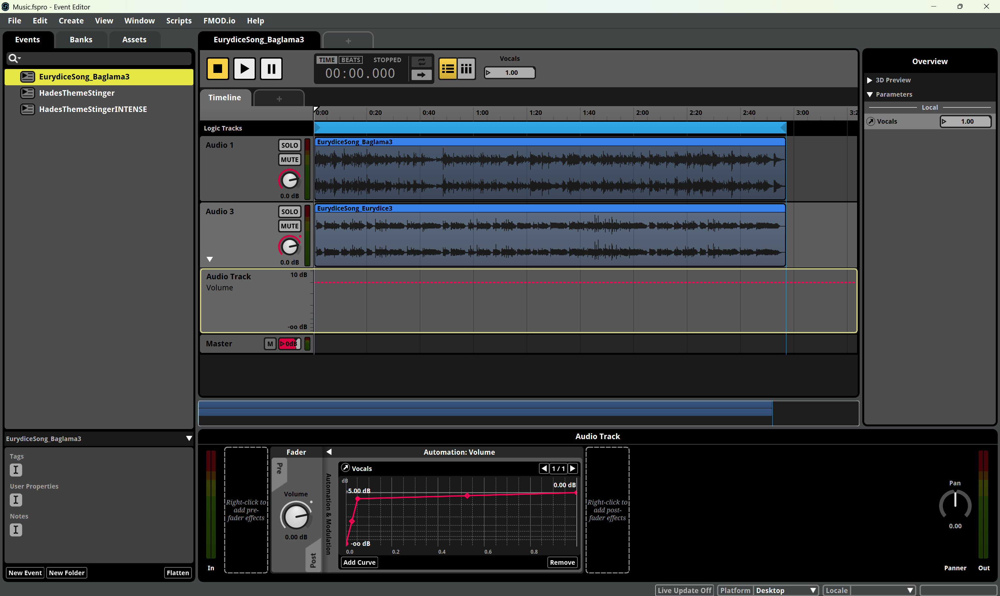

# Adding Multi-Track Music

Learn how to add new music with multiple, dynamic tracks (such as vocals, different instruments) to the game.
In the game, a track is called a `stem` (or `MusicStem`).

:::info[`MusicStem` vs `MusicSection`]
Note that the `MusicStem` system is different from the `MusicSection` system, which is used to change the style or intensity of the current track.
An example where the section would be changed is when the biome background music changes when entering a (mini-)boss room, or outside of combat.
At the time of writing, how to properly utilize this system for custom tracks has not been explored yet.
:::

:::info[Follow the general music guide first]
Before continuing to read this guide, make sure you have read and understood the [Adding Sounds & Music](./adding-sounds-music.md) guide, as this guide builds on that knowledge.
:::

## Multi-track music in Hades II

In Hades II, most music events are multi-track, meaning that they consist of multiple instrumental and vocal tracks that are toggled on and off on-demand by the game.

The most recognizable examples for this is the vocal and instrumental tracks in the Oceanus boss fight with Scylla and her band, which turns off the vocals/guitar/drum tracks when the corresponding siren has been defeated.
The logic for this can be found in `Scripts/PresentationBiomeG.lua`, in the `SirenKillPresentation()` function.
This turns off the `MusicStem` of the siren that was killed by setting the `SoundCueValue` of the corresponding stem to 0.

Another example of this system in use is the background music during a biome, these each consist of multiple instrumental tracks, only a certain number of which are randomly turned on within a room, to add more variety to a given music track.
The logic for this can be found in `Scripts/AudioPresentation.lua`, in the `RandomStemMixer()` function.
This function randomly selects a `musicSetup`, each value of which corresponds to a different combination of instruments to be played in this room.

## Creating your own multi-track music event

Follow the [Adding Sounds & Music](./adding-sounds-music.md) guide to create a new music event for the base track/first instrument of your music first.

The following sections will reference and explain the below screenshot, so refer back to it as needed:

To add additional stems to your music event, create a new track in FMOD Studio for each stem (e.g., vocals, guitar, drums).
To do so, right-click on the existing track and choose `Add Audio Track`.
The names of the tracks do not matter.
Onto these new tracks, import your asset files, these should *not* be their own events.
You may freely move the assets on the tracks, e.g. to have one start with a delay.

In the example, two audio tracks `Audio 1` and `Audio 3` were added.
The first track contains the music played by Eurydice in her Asphodel chamber, while the second track contains her vocals.
The event is called `EurydiceSong_Baglama3`, which was the asset name of the music track, this can be changed to anything you like.
The vocal track exists on the `Assets` tab (not visible), but *not* as a separate event.

For each track/stem, you'll need to set up an automation to control when it should play:

1. Right-click the volume knob of the stem track and select `Add Automation`.
2. Click into the newly created automation track to open the automation panel at the bottom.
3. Select `Add Curve` and create or select a parameter for this stem.
	- If you do not see this option, you may need to expand the `Automation & Modulation` to the right of the Fader.
4. If this is your first time using the given stem, select `Browse` -> `New Parameter` and follow [Setting up a new automation parameter](#setting-up-a-new-automation-parameter) below, otherwise select the already existing parameter for this stem.
5. Click on two different points on the curve to create new reference points.
  - Drag the left point to the very left bottom corner, so that the volume is at `-infinity` decibels when the parameter is at `0`.
	- Drag the right point to the top right, so that the volume is at `0` decibels when the parameter is at `1`.
	  - If you want to boost the audio at a value of `1`, you can change the curve to be above the `0` decibel line, but this is not recommended.
	- Create a third point and right-click -> `Edit...` to set it's position to 0.05, and it's value to something between `-10` and `-1` decibels, to allow you to fade in the stem with floating point values between 0 and 1.
	  - You don't have to add this third point if you will only ever set the stem to `0` or `1`, but if you do not set it, any values below 0.8 will be as good as muted. 

That's it - follow the generic guide to export and play your music event in the game.
Follow the [Turning tracks on and off in the code](#turning-tracks-on-and-off-in-the-code) section below to learn how to control the stems from within your mod.

### Setting up a new automation parameter

For most use cases, configure your new parameter as follows:

- Parameter Type: `User: Continuous`
- Parameter Name: The name of the stem in the game (see below for a list of all known stems), or a custom name of your choice.
- Range: 0 to 1
- Initial Value: 1
- Parameter Scope: Local
- Additional Options: Leave the defaults of only `Exposed recursively via event instruments` checked.

:::tip[Custom parameter names]
You can also create custom parameter names for your mod-specific stems. Just make sure to use those same names when controlling them via code.
:::

Known stem names in the game are: `Vocals`, `Vocals2`, `Guitar`, `Drums`, `Bass`, `ChaosBass`, `Keys`, and `Sax`.
You can re-use these if you want to integrate your new event "natively" into existing game logic.

## Turning tracks on and off in the code

A track can be turned on or off by using `SetSoundCueValue({ Names = trackNames, Id = musicId, Value = volume, Duration = fadeInOutDuration })`.

- `trackNames` is a table of the tracks to be turned on or off, e.g. `{ "Guitar" }`.
- `musicId` is the ID of which music event should be modified, e.g. `AudioState.SecretMusicId` or `AudioState.MusicId`.
- `volume` is a float between 0 and 1, with 0 meaning the track is effectively turned off, and 1 meaning it is at the default volume.
- `fadeInOutDuration` is the duration of the fade in or out, in seconds. To immediately start or stop the track, set this to `0`.

## Example

<!-- This is an actual import statement and does not appear in the text -->
<!-- Without the import (using the path directly), the video player doesn't work for some reason -->
import MultiTrackVideo from './files/MultiTrackAudioExample.mp4';

The following is an in-game example of turning the `Vocals` track off when the player interacts with Eurydice, and turning it back on when the player leaves her boon menu:

<video width="100%" controls>
  <source src={MultiTrackVideo} type="video/mp4" />
</video>

Download the example video [here](./files/MultiTrackAudioExample.mp4) if the player does not work for you.
