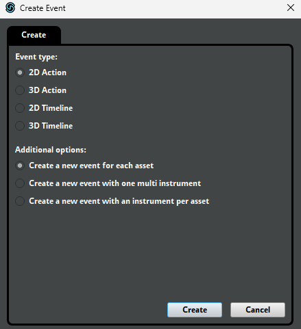
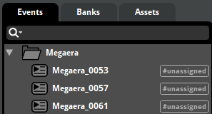
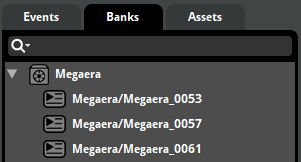

# Adding Voicelines

Learn how to add new voicelines to the game.

---

:::info[Install the required tools]
Make sure you have followed the [prerequisites](./prerequisites.md) page to install the necessary tools before proceeding.
Note that opposed the guidance in [Adding Sounds & Music](./adding-sounds-music.md), you do not need the template project linked there in order to add voicelines to the game.
:::

:::info[Reference mod]
You can refer to the work-in-progress [Hades in Hades II](https://github.com/NikkelM/Hades-II-HadesBiomes) mod as an example of how to add voicelines to the game using this method.
This project is very extensive and goes way beyond the scope of adding voicelines, so please replace this reference with another mod if you come across one that is more fitting!
:::

## Basics

In Hades II, voicelines are stored in `<SpeakerName>.fsb` files, with supporting `<SpeakerName>.txt` files that define the order of voicelines in the corresponding `.fsb` file, we'll call these two files together the "voiceover files" for a speaker.
Voiceover files exist per speaker, and can have different variants for different contexts as well, e.g. there are `MelinoeField` and `Melinoe` voiceover files, in the context of being in the Hub/Crossroads, or in a run.

Voiceover files are stored in the `Content/Audio/Desktop/VO` folder in your Hades II installation.

## Creating voiceover files

:::warning[Not all speaker name formats are supported]
Loading voiceover files is handled in-engine, and not all speaker name (filename) formats work.
If it seems the voiceover files for your speaker are not loading correctly, try using a different name.
At the point of writing this, only speaker names that already existed in Hades are known to work, original names have not been able to be loaded.
At the same time, not all Hades speaker names work either, so there will be some trial and error involved.
:::

:::warning[Compatibility with other mods]
If you want to optimize compatibility of your mod with other mods, use speaker names that other authors have not yet used, and load your voiceover files only when necessary.
:::

:::info[Example speaker name]
For this guide, we will use the speaker name `Megaera` as an example.
:::

### Prepare your voicelines

Voicelines you want to add to the game should have the following format:

```plaintext
Megaera_0053.ogg
Megaera_0057.ogg
Megaera_0061.ogg
```

The specific numbers do not matter (you do not need to have these ascending, and numbers in between can be missing), but try to adhere to the four digit numbering style that Hades II uses.
It's possible that the base assets do not have to be `.ogg` files to start with (before importing them into FMOD Studio), but it is recommended.

:::danger[Event names must start with the speaker name!]
All voiceover event names in FMOD Studio **MUST** start with the speaker's exact name, followed by an underscore `_`, otherwise the game will not load them!
Thus it is recommended to name the asset files in this format as well, to prevent requiring renaming within FMOD Studio.
:::

### Create an FMOD Studio project

Create a new project in FMOD Studio and create a folder with the name of your speaker (`Megaera`).
Import your voicelines into this folder, with each asset being imported as a new 2D event:

[](./img/voicelines/fmod_import_assets.png)

[](./img/voicelines/fmod_folder_structure.png)

Now, right-click your folder name, and select `Assign to Bank` -> `New Bank...`.
Name this bank the **exact** same as your speaker name (`Megaera`).

[](./img/voicelines/fmod_bank_structure.png)

You should now see the previous `#unassigned` tag disappear from the events in your folder, and all events having been added to the bank with the speaker's name.
Repeat this process for each different speaker you want to add voicelines for.

You can now build your project through `File` -> `Build` to create a `.bank` file for each of your speakers in the `Build/Desktop` folder of your project.

### Convert `.bank` files to `.fsb` and `.txt` files

Extract the `.bank` files you created in the previous step using FMOD bank tools, which will create a `.fsb` file for each `.bank` file in the `fsb` output folder, and a folder containing the voicelines as `.wav` files (we do not need these), as well as a `.txt` file - in the `.wav` folder.

The `.fsb` file is the voiceover file for your speaker, which you can use as-is in your mod.
In our example, we will create a `data/Content/Audio/Desktop/VO` folder for our mod, into which we can place the `Megaera.fsb` file.
The contents of this folder will be added to the `plugins_data` folder in our Thunderstore mod package.

You will need to convert the contents of the `.txt` file to the format expected by Hades II.

The file created by FMOD bank tools will contain each asset/filename (voiceline) on a new line, in the order they were added to the bank by FMOD Studio.
If you renamed your events in the project, the names in the `.txt` file will be the original names of the assets, not the renamed ones.
As long as the event name in FMOD Studio matches the folder, bank and speaker name, the game will load the correct events if if the original filename was different.
Do **not** change the names in the `.txt` file.

:::danger[Do not change the order of voicelines!]
The voicelines may be in a different order in the `.txt` file than they were in FMOD Studio, but you must not change the order of the voicelines in the `.txt` file, as this will cause the game to play the wrong events.
:::

The original file may look like this:

```plaintext
Megaera_0053.wav
Megaera_0061.wav
Megaera_0057.wav
```

In our example, the game would expect the `.txt` file to have the following format:

```plaintext
#ifndef _Megaera_H
#define _Megaera_H

#define Megaera_0053 0
#define Megaera_0061 1
#define Megaera_0057 2

#endif
```

- The `#ifndef` and `#define` lines must be added with the speaker name in the `_SpeakerName_H` format.
- For each asset/voiceline, the line must start with `#define`, followed by the original filename (without the extension), and the index of the voiceline in the `.fsb` file, starting from 0.
- The `#endif` line must be added at the end of the file.

The following snippet is a Powershell script you can use to automate the conversion of the `.txt` file:

```python
# Bank name that is being looked at
$speakerName = "Megaera"
# Reading the input .txt files directly from the output created by FMOD bank tools
$inputFile = ".\Fmod Bank Tools\wav\$speakerName\$speakerName.txt"
# The output file that will be created
# This path would work if you have a data directory in the parent folder of this script
$outputFile = ".\..\data\Content\Audio\Desktop\VO\$speakerName.txt"

# Reading the input file
$content = Get-Content $inputFile
$lineCount = $content.Length

# Add the two header lines with the speakerName
$header = @("#ifndef _${speakerName}_H", "#define _${speakerName}_H", "")

# Translate the event names to the expected format
for ($i = 0; $i -lt $lineCount; $i++) {
  $line = $content[$i] -replace '\.wav', ''
  $content[$i] = "#define $line $i"
}

# Combine the header, the modified content, and add the footer
$footer = @("", "#endif")
$finalContent = $header + $content + $footer

# Write the final content to the output file
$finalContent | Set-Content $outputFile
```

## Load voiceover files in your mod

:::info[Copy voiceover files from your mod to the game's installation directory]
The game can only load voiceover files from the `Content/Audio/Desktop/VO` folder in the game's installation directory.
At the moment, we do not have a way to load modded voiceover files directly from a mod's folder, so you will need to have your mod copy the voiceover files to the game's installation directory, or instruct users to do so manually when they install your mod.
Try to automate this process to happen once when the mod is first installed, to reduce the amount of manual work required by the user.
:::

In your mod, you can load voiceover files by name using the `LoadVoicebanks(speakerNames)` function.
`speakerNames` is a table of strings, where each string is the name of a voiceover file (speaker) to load.

```lua
game.LoadVoicebanks( { "Megaera" } )
```

If you want to load all voiceover files for a speaker, you can also use the following wildcard syntax, e.g. if you added `Megaera` and `MegaeraField` voiceover files, you can use:

```lua
game.LoadVoicebanks( { "Megaera*" } )
```

which will load all voiceover files that start with `Megaera`.
The wildcard can be placed at the start or end of the string.

In-game, you can reference voicelines by the event name in FMOD Studio, prefixed by `/VO/`, e.g. as such:

```lua
local megaeraVoicelines = {
  {
    RandomRemaining = true,
    PreLineWait = 0.25,
    Cooldowns = {
      { Name = "MegaeraSpeechCooldown", Time = 10 }
    },

    { Cue = "/VO/Megaera_0053", Text = "{#Emph}Tsch!" },
    { Cue = "/VO/Megaera_0057", Text = "Hmph.", PlayFirst = true },
    { Cue = "/VO/Megaera_0061", Text = "Hmm." },
  },
}

game.thread(PlayVoicelines( megaeraVoicelines ))
```

...or add the new cues to existing voiceline tables.

:::info[Subtitles]
As of yet it is unclear how to add substitles for custom voicelines.
If you find a way to do this, please update this page!
:::
