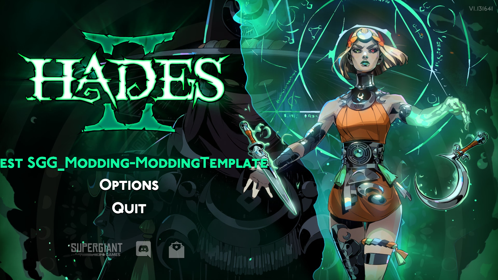
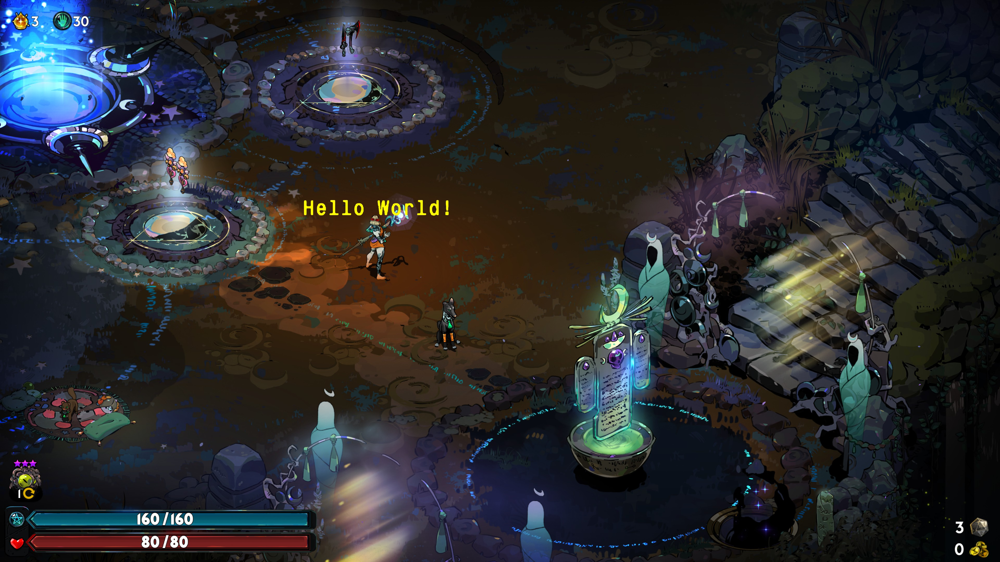

# Using the Mod template

*Please ensure you've read the [Introduction](./0-intro.md) before starting this guide.*

---

## Setting up a local copy

In this first part of the guide, you'll learn how to clone and set up your own copy of the [Hades II Mod template](https://github.com/SGG-Modding/Hades2ModTemplate), as well as understand it's contents and basic layout.

To get started, navigate to the latest release of the [Hades II Mod template](https://github.com/SGG-Modding/Hades2ModTemplate/releases/latest), and download the `hades2-mod-template.zip`.
Unzip the contents of this folder to where you'll be doing your mod development, open it in your chosen code editor and push the contents to a new GitHub repository.

:::note[Symlinking to r2modman]
It's recommended to create a symlink from your mod development folder to the `ReturnOfModding` folder used by r2modman, as described in the [Development Environment](../development-environment.md#creating-a-aymbolic-link-from-your-development-directory-to-r2modman) guide.
:::

## Creating a Thunderstore team

To publish your mods to Thunderstore, you need to create a **Team**.
This is the name shown as the mod author on your mod page, and will be part of your mod's unique identifier on Thunderstore.
A mod's team (just like its name) cannot be changed after publishing, so choose wisely.

To make use of the [release workflow](#release-workflow) included in the mod template, you will also need to create a **Service Account** for your mod, and add its API token as a secret in your GitHub repository:

- To create a team, first sign up for a [Thunderstore](https://thunderstore.io/c/hades-ii/) account, on the top right. You can choose to sign up using your GitHub account, which is recommended, or a Discord or Overwolf account.
  - After signing in, go to the [Teams settings](https://thunderstore.io/settings/teams/) on Thunderstore and create a new team. New options should appear in the left sidebar.
  - Create a new **Service Account** for your mod (we recommend using the same name as the mod name, to keep service accounts separate from each other and easily identifiable).
  - You will get an **API token** associated to the new **Service Account**. Copy this token now, as it will not be shown again. If you lose it, you will need to remove and recreate the service account.

- In your GitHub repository:
  - Go to **Settings** > **Secrets and variables** > **Actions**.
  - Create a **new repository secret** named `TCLI_AUTH_TOKEN` and copy/paste the **API token** as its value.

## Understanding the components

You can learn more about each of the core files in the template by expanding the sections below:

<h3><a id="thunderstore-toml">thunderstore.toml</a></h3>

This file contains all of the metadata required for publishing your mod to Thunderstore.
You can find the full specification for both the contents of this file and other parts of your mod package in the [Thunderstore package format requirements](https://thunderstore.io/c/hades-ii/create/docs/) online.

#### `[config]`

This contains the schema version of the `thunderstore.toml` file.
You should not need to change this.

#### `[package]`

- `namespace`: This is your Thunderstore team name, which is the author name shown on your mod page. Once set, this cannot be changed without creating a new team and republishing your mod.
- `name`: The name of your mod. Like the team name, this cannot be changed for an already published mod. It cannot contain spaces or any special characters besides underscores. Underscores are converted to spaces for display purposes on some views (like the mod browser).
- `versionNumber`: The version of your mod, which should follow [Semantic Versioning](https://semver.org/). Thunderstore only supports the `Major.Minor.Patch` format.
- `description`: A short description of what your mod does. It is shown in the mod browsers online and in r2modman. Cannot be longer than 250 characters.
- `websiteUrl`: A URL to your mod's website (e.g. your GitHub repository). It is highly recommended to include your GitHub repository here, as this is the primary way for users to file bug reports and leave feedback, as Thunderstore does not have discussion or comment functionality. If you don't have URL, leave this as an empty string `""`.
- `containsNsfwContent`: Whether your mod contains any NSFW content. All mods with NSFW content must be marked as such. NSFW is a search filter on Thunderstore that must be explicitly enabled by users.

#### `[package.dependencies]`

This should be a list of mods that your mod depends on to function.
The mod template already contains a list of dependencies that will be required by most mods.
You should not have to remove any of these, unless you know for certain you do not require them.
These dependencies will already be installed by most users through other mods, so having them listed here will not cause any issues.

If you need to depend on a new mod, you can add it here as `"AuthorName-ModName" = "version"`.
Note that this is not a pinned version, and by default, Thunderstore will always get the latest version of any dependency.
So if a later version of one of your dependencies breaks your mod, this will not prevent users from updating to that version.

#### `[build]` sections

The `[build]` section defines what files are included in your mod package when you publish it to Thunderstore.
The `icon`, `readme` and `outdir` fields should not be changed.

The `[build.copy]` sections define fieles and directories that are copied from your source folder into the built mod package.
The two most relevant of these are the `./src` folder being copied to `./plugins`, and the `./data` folder being copied to `./plugins_data`.
You must not change the target folders, as these are used by the mod loader to discover your mod.
You may change the source folders if required.

Copying the `./data` folder is commented out of the template by default, as it doesn't include any data files (such as `.pkg` packages or `.bank` sound files).
Change this if your mod includes these.

#### `[publish]` sections

You must not change the `[publish]` section, as this defines that your mod will be published to the Hades II community on Thunderstore.

You may add additional, *existing* tags to the `[publish.categories]` list if you wish.
See the [Thunderstore API](https://thunderstore.io/api/experimental/community/hades-ii/category/) for a full list of available categories.

<h3>Readme.md, Changelog.md, License & icon.png</h3>

The `Readme.md` should contain a description of your mod, alongside any possible configuration option (see [config.lua](#config) below).
The contents of the Readme will be shown on the Thunderstore mod page.
If you link any images in the Readme, these must be URLs, as relative paths to files in your repository will not work.

The `Changelog.md` should contain a list of changes made in each version of your mod.
A short guide on how to use the file is included in the template - remove this guidance before publishing.

In the `LICENSE` file, replace the `[year]` and `[fullname]` placeholders.
By default, the template ships the [MIT license](https://choosealicense.com/licenses/mit/), which is recommended to use in this community.

The `icon.png` is the icon shown for your mod on Thunderstore and in r2modman.
It *must* be a 256x256 PNG icon.

<h3><a id="release-workflow">.github/workflows/release.yaml</a></h3>

This file contains a GitHub Actions workflow that builds and publishes your mod package to both GitHub and Thunderstore.
To release a new package version, follow these steps, first follow the [Creating a Thunderstore team](#creating-a-thunderstore-team) guide and create a service account as shown there.

- To trigger a new release, from your GitHub repository go to **Actions** and select the **Release** workflow on the left.
- Select the **Run workflow** dropdown on the right.
  - By default, your repository's default branch (`main` by default) is selected. If you want to release from another branch, select it.
- Input the version to release, e.g. `1.2.0`.
  - For good practices on versioning, please see [Semantic Versioning](https://semver.org/spec/v2.0.0.html).
- Click the **Run workflow** button.
- A new workflow run will be triggered, and will take care of:
  - Rotating version in `CHANGELOG.md` and `thunderstore.toml`.
  - Building the Thunderstore mod package.
  - Uploading the package to the workflow run as an artifact.
  - Pushing the changes and tagging the git repository.
  - Publishing the package on Thunderstore.
  - Making a new GitHub release.
  - Uploading the package to the GitHub release as an asset.
- After a new release has been published, you should `git pull` the changes to ensure your local `CHANGELOG.md` and `thunderstore.toml` are up to date.

### The `data` folder

This folder is not included in the template by default, as it doesn't have any files that would go in here.
If your mod distributes any binary files, such as `.pkg` asset packages or `.bank` sound files, they should be placed in this folder.
When building your mod package, this folder will be copied to `plugins_data`, which is where the mod loader looks for these files (remember to uncomment the relevant section in the [`thunderstore.toml`](#thunderstore-toml) file). 

### The `src` folder

The `src` folder is where your mod's code goes.
The template already contains boilerplate code to integrate your mod with [Hell2Modding](https://thunderstore.io/c/hades-ii/p/Hell2Modding/Hell2Modding/), our mod loader for Hades II.

---

#### `main.lua`

Start by opening the `main.lua` file.
This file contains the entry point for your mod, and contains a number of boilerplate definitions and assignments that you should not change.
How all of these work in detail won't be covered in this guide.

The most relevant parts for you are the `on_ready()` and `on_reload()` functions.
These two functions are where you should import any other lua files you create, as is shown with the existing imports of the `ready.lua` and `reload.lua` files.

The content of the `on_ready()` function is run once, when your mod is first loaded, while the content of the `on_reload()` function is run every time your mod is reloaded (when you change one of it's files in the `plugins` folder).
This is why it is recommended to [create a symlink](../development-environment.md#creating-a-aymbolic-link-from-your-development-directory-to-r2modman) from your development directory to the `plugins` directory, as that way you can make changes to your mod without needing to rebuild the package and restart the game to see them applied.

---

#### `ready.lua` and `reload.lua`

Let's take a look at what the `ready.lua` and `reload.lua` files currently do in the template:

1. From `ready.lua`, it uses the `sjson` dependency library to "hook" into the game's `ShellText.en.sjson` file, which contains text that is e.g. displayed on the main menu of the game.
	- Localization files are located in `Game/Text/<languageShorthand>/<fileName>.<languageShorthand>.sjson`, and you need to hook into each one separately if you want to modify their contents.
	- This hook is executed when the game loads the file, which is done only once on game start.
	- It passes the data to `sjson_ShellText(data)`, which is defined in `reload.lua`, and which will modify the text shown on the `Play` button on the main menu.
	- The `_PLUGIN.guid` referenced in this modification is the `AuthorName-ModName` unique identifier of your mod.
	- When you locally install your mod, loading into the main menu should now show `Test <AuthorName-ModName>` instead of `Play`:

2. From `ready.lua`, we also "wrap" the function `SetupMap()`, which is defined by the game.
  - In `function(base, ...)`, `base` is the original function, and `...` are any arguments passed to it.
	- In a wrap, you should always call the original function either before or after your own code, depending on the modification you need to make. Otherwise the original function will not be executed at all. If this is what you want, consider using `modutil.mod.Path.Override` instead.
	- In this case, we call the `prefix_SetupMap()` function defined in `reload.lua` before calling the original function.
	- The `prefix_SetupMap()` function currently only adds a message to the log console that opens when you start the game modded, but this is where you could for example load any custom packages (`.pkg` files) required in each level.
	- You can wrap or override any function defined by the game through lua, but be mindful of compatibility with other mods that may also be wrapping or overriding the same functions.

3. Finally, the template registers a new function call to be executed when the player presses the key mapped to the `Gift` functionality - on keyboard, this would be the `G` key by default.
	- When this key is pressed, the mod will execute the `trigger_Gift()` function defined in `reload.lua`.
	- The original function calls the game defines to be called when this key is pressed are also executed alongside this new function.
	- The `trigger_Gift()` function will add a log message above the player character (this call should be used for debugging only, as the game provides other functions for this to integrate more natively):

---

#### `config.lua`

This file is where you should define any configuration options that users of your mod should be able to change.
r2modman will automatically generate a configuration file that can be modified through the app, based on the contents of this file.

In the template, the `message` configuration option can be used to change what floating text is shown by `trigger_Gift()` when the `G` key is pressed.

Configuration files will persist even after your mod is uninstalled.

---

#### `def.lua`

Unless you are creating a library mod that exposes functions to be used by other mods, you do not need this file and can safely delete it.
If you do want to expose functions to other mods, this is where you should document them.

## Video walkthrough

Here is a [video walkthrough](https://www.twitch.tv/videos/2599166443) of setting up a simple mod. The video goes over:
- Creating your mod starting from the template
- Running your mod locally
- Demoing the template functionality and talking through the template code

---

Once you've understood these basic concepts, you can continue on to the next page, where we'll create a simple portrait replacement mod using the template: [Portrait replacement](./2-portrait-replacement.md).
