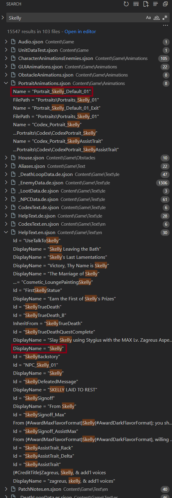
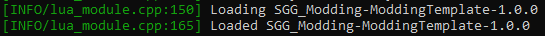

# Creating a Portrait Replacement Mod

Use `deppth2` to replace Schelemeus' portrait with Skelly from Hades.

---

In this guide, we'll take the basic [mod template](https://github.com/SGG-Modding/Hades2ModTemplate) as explored in the previous section, and use it to build a portrait replacement mod that swaps out Schelemeus' portrait with Skelly from Hades.

## Understanding deppth2

To build a portrait replacement mod, you'll need to understand [deppth2](https://github.com/SGG-Modding/deppth), which you can install using the following command:

```bash
pip install deppth2
```

`deppth2` is a tool build by the Hades modding community that allows you to unpack `.pkg` files shipped with Hades, Hades II and other games by Supergiant Games.
It can also pack `.png` files back into `.pkg` files, which can then be loaded in the game through mods, which is what we will be doing in this guide.

Before we take a look at any of the code for our mod, let's start with creating the `.pkg` file that we want to load through our mod.
Since we want to use Skelly's portrait from Hades, we will first need to find and unpack the relevant `.pkg` file from Hades.

:::note[Owning Hades]
If you do not own a copy of Hades, you can create your own portrait file to use for the rest of the guide instead.
It is recommended to still read this section, as other concepts useful for modding Hades II are explained here as well.
:::

## Where is...?

*This part of the guide may use the Hades codebase as an example, but applies to Hades II in the exact same way!*

We will first need to find out in which package Skelly's portrait is located.

Open the `Content/Scripts` folder of your Hades installation in your code editor, and open the search window.

:::info[Similarities between Hades and Hades II]
Many things in Hades II are similar to Hades, including the folder structure of your installation, as well as many shared functions and other functionality.
If you know your way around the Hades codebase, you will quickly understand Hades II as well.
:::

Searching for `Skelly` will produce a large number of results - it's important to know where to look for things!



If you have no idea where to look, the `HelpText.en.sjson` file is always a good start.
This file contains almost all of the text you see on-screen in the game, such as NPC names, item and boon descriptions, and so on.
More such definitions are located in the other `xxText.en.sjson` files in the same folder.

In our example, we can see there is a match for Skelly for `DisplayName = "Skelly"` in this file.
Selecting it will show that while `Skelly` is the name shown to players, the internal name for him is actually `TrainingDummy`.

Searching for `TrainingDummy` will find a result in the `EnemyData.lua` file, and this table contains a field called `Portrait` with the value of `Portrait_Skelly_Default_01`.
That's exactly what we are looking for!

If you already know your way around a couple of the files in the game, you may have noticed that our first search also had a match for `Skelly` in the `PortraitAnimations.sjson` file, and may have guessed that this will contains what we were looking for - the whole match was `Portrait_Skelly_Default_01`, the same which we found later on in the `EnemyData.lua` file.

Let's take a look at the definition for `Portrait_Skelly_Default_01` in the `PortraitAnimations.sjson` file:

```sjson
{
  Name = "Portrait_Skelly_Default_01"
  InheritFrom = "Portrait_Base_01"
  FilePath = "Portraits\Portraits_Skelly_01"
  EndFrame = 1
  StartFrame = 1
  Sound = "/SFX/Enemy Sounds/MiscBoneRattle3"
}
```

What we're interested in here is the `FilePath` field, which tells us in which "folder" the portrait is located in.
These folders are located in one (or more) `.pkg` files in the `Content/Win/Packages` folder (or `Content/Packages` for Hades II).
Looking in this folder for a `Portraits.pkg` file doesn't yield any results however!

We'll need to do some guesswork - you'll need this a lot when building mods - to find the correct package.
Looking at the package names available to us, the closest match seems to be the `GUI.pkg` file (GUI stands for Graphical User Interface).

:::info[Portrait packages in Hades II]
In Hades II, almost every character has their own package, named after them.
These will almost always contain their portraits as well, making it a lot easier to find the correct package than it is in Hades.
:::

## Unpacking packages

Let's unpack the `GUI.pkg` package using `deppth2`.
Open a terminal in the folder containing the packages, and run the following command:

```bash
deppth2 ex -s GUI.pkg
```

- `deppth2` will run the tool.
- `ex` is the command to extract a package.
- `-s` tells the tool to also extract the individual source files from the "atlas" files making up the package. Without this flag, you would get larger image files containing multiple textures, which is not what we want.
- `GUI.pkg` is the name of the package we want to extract.

Within the created directory, you will find a `texture/Portraits` folder - and this folder contains the `Portraits_Skelly_01.png` file we are looking for, just as the `FilePath` field in the portrait definition told us.
Copy this file.

## Creating new packages

Within your mod project folder, create a new `packages` folder at the same level as the `src` folder.
To not include it in your git repo, you may want to add this folder to your `.gitignore` file.

Within the `packages` folder, we will create a `SGG_Modding-ModdingTemplatePortraits_source` folder to contain our new portrait, and place the copied `Portraits_Skelly_01.png` file within it.
You can create additional folders within the package as you want, but don't nest them too deeply, as this may cause issues with file paths being too long in some cases.

Now, open a command line in the `packages` folder, and run the following command:

```bash
deppth2 hpk -c BC7 -s SGG_Modding-ModdingTemplatePortraits_source -t SGG_Modding-ModdingTemplatePortraits
```

- `deppth2` will run the tool
- `hpk` is the command to create a new package using the included packing utility for Hades II. The `pk` command also works, but requires you to manually create the manifest and atlas files required beforehand, so `hpk` is recommended for most use cases.
- `-c BC7` tells the tool to use BC7 compression for the textures in the package. This will decrease the file size of your package, so is recommended in most cases, and required for large packages. For smaller packages, you may omit the `-c` flag.
- `-s SGG_Modding-ModdingTemplatePortraits_source` tells the tool the path to the folder that should be packed into the new package.
- `-t SGG_Modding-ModdingTemplatePortraits` tells the tool the target name of the package to create, without the `.pkg` extension.

To ensure that your mod's packages don't clash with any other mods, all of your packages must adhere to the `AuthorName-ModName<PackageName>.pkg` naming scheme, which is enforced by the `-t` flag when using `deppth2 hpk`.

After running the command, you should have a new folder called `SGG_Modding-ModdingTemplatePortraits`, as well as a `SGG_Modding-ModdingTemplatePortraits.pkg` and a `SGG_Modding-ModdingTemplatePortraits.pkg_manifest` file within the `packages` folder.
The `.pkg` and `.pkg_manifest` files are what we need, but you may also want to take a look at the created folder if you are interested - this contains the manifest and atlas files created by `deppth2 hpk`, which you would have to create manually if using `deppth2 pk`.

Now, create a new `data` folder at the same level as the `src` and `packages` folders, and copy both the `.pkg` and `.pkg_manifest` files into it.
The `data` folder will contain any non-code files that you want to distribute with your mod.

## Loading a custom package in Hades II through code

Now that we have our `.pkg` file ready to go, we need to modify the template to load it in the game.
We want to load this package whenever the player is in the training grounds, as this is where they can talk to Skelly - loading it on every map load would waste resources.

We will show three different ways of how a new package may be loaded - these are all good to know, and certainly not the only ways to do this.
Two of the three methods will need to call a new function in your mod that loads the actual package, so let's start by adding this to the `reload.lua` file.

Remove everything below the comments at the top of the file, and add the following code:

```lua
function mod.LoadSkellyPackage()
  local packageName = _PLUGIN.guid .. "Portraits"
  print("SGG_Modding-ModdingTemplate - Loading package: " .. packageName)
  LoadPackages({ Name = packageName })
end
```

Using `function mod.LoadSkellyPackage()` will define the function in your mod's namespace, which is a good practice for cleaner code.

`_PLUGIN.guid` will always resolve to `AuthorName-ModName`, and since our packages are named using this scheme, we can use this to build the package name.
`..` is the Lua string concatenation operator, so this will set `packageName = "SGG_Modding-ModdingTemplatePortraits"`.

The `print()` statement is just for debugging our mod - when releasing your mods, you should remove all print statements, as they will spam the log file otherwise.

`LoadPackages()` is a function provided by the game engine to load a package by name.
Usually, packages are located in the `Content/Packages` folder in Hades II, but [Hell2Modding](https://github.com/SGG-Modding/Hell2Modding), our mod loader for Hades II, automatically registers all packages contained in the `plugins_data` folder to the game as well.

:::warning[plugins_data]
All `.pkg` files located in any subdirectory of the `plugins_data` folder will be automatically picked up by Hell2Modding.
You should never place any package files directly in the game's package directory in your mods!
:::

If you have set up your intellisense for VS Code up correctly, you will now also see that `mod` is marked as an undefined global - let's fix that.

In your `main.lua` file, you can register your mod with modutil (a dependency for all mods using the template) at the top of the `on_ready()` function as follows:

```lua
local function on_ready()
  mod = modutil.mod.Mod.Register(_PLUGIN.guid)
  ...
end
```

The warning about the undefined global in your `reload.lua` file should now be gone.

Now, let's take a look at the different ways we can make sure our package is loaded when we want it to be - remember that you only need to use one of these three, and if you need to load packages in other circumstances, there may be different options available to you.

### Method 1: Wrapping a fitting function call

The first way is to find a function that runs in the situation you want to load your packag, and optimally just then - you can wrap this function and add some code to load your package.
In your `ready.lua` file, remove everything below the comments at the top, and add the following code:

```lua
modutil.mod.Path.Wrap("DeathAreaRoomTransition", function(base, source, args)
  if game.CurrentHubRoom.Name == "Hub_PreRun" then
    mod.LoadSkellyPackage()
  end
  base(source, args)
end)
```

Here, we wrap the `DeathAreaRoomTransition` function, which is called whenever the player moves from the Crossroads hub room to the training grounds, or the other way around.
Since we only want to load our package in the training grounds, we check if the current hub room is `Hub_PreRun`, which is the internal name for the training grounds.
If it is, we call our `mod.LoadSkellyPackage()` function to load our package.

Finally, remember to always call the original function with its arguments using `base(<arguments>)` when wrapping a function - you can call `base` before or after your code, depending on when you want the original function to run.

### Method 2: Appending to built-in event tables

Many objects in the game, such as rooms, encounters and NPCs, have event tables that are run in certain situations, such as when a room is loaded that they are included in.
This is also the case for Schelemeus in Hades II - searching for `Schelemeus` and finding his internal name (`NPC_Skelly_01`) in the Hades II codebase - the same way we did for Skelly before in Hades - brings us to the definition of `NPC_Skelly_01` in the `NPCData_Skelly.lua` file.
This table contains a `SetupEvents` table, which contains a number of events, or function calls, that are run whenever the NPC is spawned in a room.

We can add a new function call to this table which will load our package.
Add the following to your `ready.lua` file:

```lua
local loadSkellyPackageCall = { FunctionName = _PLUGIN.guid .. ".LoadSkellyPackage" }

table.insert(game.EnemyData.NPC_Skelly_01.SetupEvents, loadSkellyPackageCall)
```

The format of the event that is added to the table is defined by the way the existing `SetupEvents` are defined, and this may be different for other event tables.

Using `table.insert`, we can insert a new table `loadSkellyPackageCall` into the `SetupEvents` table of `EnemyData.NPC_Skelly_01`.
You may notice that while at the top of the `NPCData_Skelly.lua` file, the `NPC_Skelly_01` table is defined in the `UnitSetData.NPC_Skelly` table - but looking further down at the bottom, the children of this table are actually merged into the global `EnemyData` table (since you can attack Schelemeus, he is considered an enemy), which is what we need to modify.
It's important to be aware of these little things, as without knowing where tables actually end up, you won't be able to correctly modify them.

### Method 3: Adding to a `LoadPackages` property

Some objects in the game have a `LoadPackages` property, which is a table of package names that should be loaded whenever the object is instantiated - enemies and NPCs are one such type of object, and you can find a `LoadPackages` property in the definition for `NPC_Skelly_01`:

```lua
NPC_Skelly_01 = {
  ...
  LoadPackages = { "Skelly" },
  ...
}
```

Just as we appended to the event table in the previous method, we can also simply append our new package name to this table instead!
This way, we don't even need the `mod.LoadSkellyPackage()` function we created earlier (and if you use this method, you should remove that function call).

Add the following to your `ready.lua` file:

```lua
local customPortraitsPackageName = _PLUGIN.guid .. "Portraits"

table.insert(game.EnemyData.NPC_Skelly_01.LoadPackages, customPortraitsPackageName)
```

This will make sure that our custom package is loaded whenever the game spawns Schelemeus.

## Replacing the portrait texture used by Schelemeus

Now that we have the code that loads our package (only use one of the three methods shown above!), we need to actually tell the game that it should use the new portrait for Schelemeus.
Just as we did in Hades, we can find the portrait used by Schelemeus in his definition in the `NPCData_Skelly.lua` file:

```lua
NPC_Skelly_01 = {
  ...
  Portrait = "Portrait_Skelly_Default_01",
  ...
}
```

Searching for this portrait name will lead us to the `Content/Game/Animations/GUI_Portraits_VFX.sjson` file, with the following definition for the portrait:

```sjson
{
  Name = "Portrait_Skelly_Default_01"
  InheritFrom = "Portrait_Base_01"
  FilePath = "Portraits\Skelly\Portraits_Skelly_01"
  EndFrame = 1
  StartFrame = 1
  Sound = "/SFX/Enemy Sounds/MiscBoneRattle3"
  CreateAnimations = [			
    { Name = "Portrait_Skelly_Wiggle1_In" }
    { Name = "Portrait_Skelly_Wiggle2_In" }
    { Name = "Portrait_Skelly_Wiggle3_In" }
    { Name = "Portrait_Skelly_Wiggle4_In" }
    { Name = "Portrait_Skelly_Blink" }
    { Name = "Portrait_Skelly_MoonGlow_In" }
    { Name = "Portrait_Skelly_MainGlow"}
    { Name = "Portrait_Skelly_Glint" }
  ]
}
```

We need to change the `FilePath` used here to point to our new portrait in our custom package instead.

For this, we will use an sjson hook, to modify the contents of the `GUI_Portraits_VFX.sjson` file when it is loaded at game start.
Since this file is loaded only once, we should add this code to the `ready.lua` file, as it is no use to call this code whenever the mod is reloaded.

Add the following to your `ready.lua` file:

```lua
-- All packages built by `deppth2 hpk` will have the package name as part of all file paths, to prevent mods from clashing
-- If you added any nested folders in your package, include them here as well
local newPortraitFilePath = _PLUGIN.guid .. "Portraits\\Portraits_Skelly_01"

-- rom.path.combine is provided by Hell2Modding to build file paths correctly across different operating systems
-- rom.paths.Content() will return the path to the Content folder of the current Hades II installation
local guiPortraitsVFXFile = rom.path.combine(rom.paths.Content(), "Game\\Animations\\GUI_Portraits_VFX.sjson")

sjson.hook(guiPortraitsVFXFile, function(data)
  for _, entry in ipairs(data.Animations) do
    if entry.Name == "Portrait_Skelly_Default_01" then
      entry.FilePath = newPortraitFilePath
    end
  end
end)
```

This will execute the hook when the `GUI_Portraits_VFX.sjson` file is loaded, and modify the `FilePath` of the `Portrait_Skelly_Default_01` entry to point to our new portrait in our custom package.

## Building and testing our mod locally

Now that we have created the package, written the code to load it and changed the file path used by the portrait, we need to locally test our mod to see if it works before we can release it.

:::warning[Local testing]
You must *always* test your mods locally before publishing them!
:::

Since we added something to the `data` folder, we need to ensure it is included in our mod correctly - open the `thunderstore.toml` file and uncomment the `[[build.copy]]` command that copies the `data` folder to the `plugins_data` folder, by removing the `#` at the start of the relevant lines.

Then, follow the [Local Testing](../development-environment.md#local-testing) section of the development environment guide to locally build your package and import it to r2modman as a local mod.

Now that your mod package is added, using `Start modded` in r2modman should open both Hades II and a new console window.
This console contains a lot of useful logs from the game itself, Hell2Modding (the mod loader), as well as logs from any print statements added by your mod.

If you've done everything correctly, the console should contain the following line just before it shows loading the game's `.lua` files:



When entering the Training Grounds, the log should also show the following lines, which is first the print statement added in the `mod.LoadSkellyPackage()` function, and then the log from the game showing that it has loaded the package successfully:


If you now go and talk to Schelemeus, what you see should look something similar to this:


It looks like the Skelly portrait is there, but there's a lot of other animations being overlaid on top of it.
In Hades II, all portraits have additional animations on top of them, which makes them seem more alive - but these won't work with our custom portrait, as they don't align.
If you look back at the definition of `Portrait_Skelly_Default_01` in the `GUI_Portraits_VFX.sjson` file, you'll see a `CreateAnimations` table, which contains all of these additional animations.
These are automatically created and added to the portrait when it is shown on-screen.

To ensure these animations are not added on top of our custom portrait, we need to clear the `CreateAnimations` table in our hook:

```lua
sjson.hook(guiPortraitsVFXFile, function(data)
  for _, entry in ipairs(data.Animations) do
    if entry.Name == "Portrait_Skelly_Default_01" then
      entry.FilePath = newPortraitFilePath
      entry.CreateAnimations = {}
    end
  end
end)
```

If you have not created a symlink, remember to rebuild and import your package to r2modman again, then restart the game.


That already looks a lot better, but we can now see that our portrait is misaligned - it's too high up.
Let's modify the definition of `Portrait_Skelly_Default_01` in our hook to add an `OffsetY` field, which will move the portrait down just far enough to align with the bottom of the screen.
If you do this for your own portraits, you may need to experiment a bit with the value to get it just right.

```lua
sjson.hook(guiPortraitsVFXFile, function(data)
  for _, entry in ipairs(data.Animations) do
    if entry.Name == "Portrait_Skelly_Default_01" then
      entry.FilePath = newPortraitFilePath
      entry.CreateAnimations = {}
      entry.OffsetY = 0
    end
  end
end)
```

You may wonder why we set the `OffsetY` to `0` here, does this even make a difference?
Yes it does, as the original definition of `Portrait_Skelly_Default_01` has an `InheritFrom` property, set to `Portrait_Base_01` - this means that all properties that are not defined by the child (`Portrait_Skelly_Default_01`) are inherited from the parent (`Portrait_Base_01`).
Looking at the definition for `Portrait_Base_01`, we can see that it has an `OffsetY` property set to `-100`, which moves any portrait that inherits from it up by 100 units - this may work for the portraits defined in Hades II, but it doesn't for our custom portrait.
`0` just happens to be the correct offset in this case, but other custom portraits may need a different value.

:::info[Inheriting properties]
Many objects in the game, both defined in `.sjson` and `.lua` files, have an `InheritFrom` property, which means that they will inherit any properties not defined by themselves from the parent object.
If you find that something isn't working as expected, check if the object may inherit something from its parent that is causing the issue.
:::


Nice, the portrait is properly aligned now!
However, when advancing the dialogue, you will notice that the portrait temporarily switches back to the original Schelemeus.
Looking at the `GUI_Portraits_VFX.sjson` file again, we can see that just below the definition for `Portrait_Skelly_Default_01`, there is a definition for `Portrait_Skelly_Default_01_Exit` - this is an animation played when the portrait exits the screen, so we need to modify the `FilePath` for this one as well in our hook:

```lua
sjson.hook(guiPortraitsVFXFile, function(data)
  for _, entry in ipairs(data.Animations) do
    if entry.Name == "Portrait_Skelly_Default_01" or entry.Name == "Portrait_Skelly_Default_01_Exit" then
      entry.FilePath = newPortraitFilePath
      entry.CreateAnimations = {}
      entry.OffsetY = 0
    end
  end
end)
```

While the exit portrait does not define a `CreateAnimations` property, we can still set it to an empty table here - it won't cause any issues and makes the code cleaner.
The exit portrait inherits from `Portrait_Base_01_Exit`, which itself doesn't define an `OffsetY` property - but it does inherit from `Portrait_Base_01`, which we know would cause issues for us, so we want to set `OffsetY` to `0` here as well.

Talking to Schelemeus again now should consistently show the Skelly portrait all the way through the conversation, well done!

There are a lot more properties you can modify for portraits - and most other animations - such as the `Scale`, `OffsetX`, or even flipping the texture using `FlipHorizontal` or `FlipVertical`.

## Closing Thoughts

This guide has shown you how to create a simple portrait replacement mod for Hades II, but there is a lot more you can modify in the game.
Take some time to explore the mods available in our [Thunderstore community](https://thunderstore.io/c/hades-ii/).
Many mod authors include a link to the mod's source code on GitHub on the mod's page, which is a great way to learn more about the possibilities of Hades II modding.

Also join the [Hades Modding Discord](https://discord.gg/KuMbyrN) to ask questions, share ideas, and connect with other members of the community.

If there are any improvements you'd like to see in this guide, or would like to create your own guides for different aspects of modding for the game, we welcome any contributions to the [wiki's GitHub repository](https://github.com/SGG-Modding/Hades2ModWiki).

