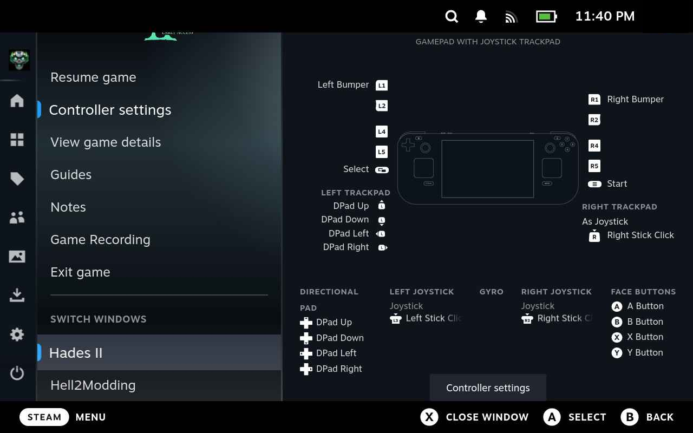

# Steam Deck Installation

:::danger[Install to Internal Storage Only]
Before starting, make sure Hades II is installed to the Steam Deck's internal storage, NOT the MicroSD card!
:::

## Part 1 - Getting r2modman to work in Gaming Mode
### 1. Enter Desktop Mode
- Press the `STEAM` button.
- Go to `Power`.
- Select `Switch to Desktop`.

### 2. Download and install AppImageLauncher
:::info[Why AppImageLauncher?]
Steam will not run `.AppImage` files by default and we need a workaround for this.
:::
- Download the **AppImageLauncher** installer from the [AppImageLauncher Github releases page](https://github.com/TheAssassin/AppImageLauncher/releases/download/v2.2.0/appimagelauncher-lite-2.2.0-travis995-0f91801-x86_64.AppImage).
- Move the **AppImageLauncher** `.AppImage` file to your **Home** directory.

- Open up **Konsole** (from the bottom left Start button > System > Konsole)

- Copy the following text:
```bash
chmod +x appimagelauncher-lite-2.2.0-travis995-0f91801-x86_64.AppImage
./appimagelauncher-lite-2.2.0-travis995-0f91801-x86_64.AppImage install
```
- Paste it into Konsole using the `Paste` button in the top-right of the application.

- Press `Enter` on your keyboard (`STEAM+X`).

### 3. Download and install r2modman
- Download the **r2modman** installer from the [Thunderstore r2modman page](https://thunderstore.io/c/hades-ii/p/ebkr/r2modman/)
  - Important - use the "Manual Download" button!
  
- Open the downloaded file and move the **r2modman** `.AppImage` file into your **Home/Applications** directory.


### 4. Add r2modman as a Non-Steam Game
- Open **Steam** in Desktop Mode. There should be a shortcut on your desktop.
- Click the **Games** menu.
- Click **Add a Non-Steam Game to My Library**.

- Locate **r2modman (version number)** in the list by *scrolling*, NOT **Browse**.
- Select it and click **Add Selected Programs**.

Congratulations! You can now open **r2modman** in Gaming Mode, in the **Non-Steam** category of your library.

:::info[Controlling r2modman]
You will want to either use the Touchscreen for mouse control within r2modman, or change the Controller scheme in Steam for the r2modman "game" to be set to the **Keyboard (WASD) and Mouse** template.
:::

---

## Part 2 - Booting Hades II directly with mods in Gaming Mode
:::info[What does this mean?]
The steps in [Part 1](#part-1---getting-r2modman-to-work-in-gaming-mode) only allow you to run modded if you start **r2modman**, then select **Start Modded**. These steps will further automate the process, forcing the Hades II shortcut to properly load your mods.
:::
### 1. Enter Desktop Mode
- Press the `STEAM` button.
- Go to `Power`.
- Select `Switch to Desktop`.

### 2. Open r2modman
- Search for *Hades II*.
- Click **Select Game**.
- Click **Select Profile** to continue with the Default profile (or make a new profile if you like).
- Browse the **Online** mod section.
- Install at least ONE mod.
- Click **Settings**.
- Scroll down to **Change Hades II folder** and click.
- Navigate into the *Ship* directory.
- Select *Hades2.exe*.
- Click **Select Executable**.
- Keeping **r2modman** open, go to Step 3.

### 3. Open Steam
- Go to the **Properties** for *Hades II*.
- In **General > Launch Options**, input the following text:
```
WINEDLLOVERRIDES=d3d12=n,b %command%
```
- In **r2modman**, click **Help** and scroll to the bottom.
- Click the **Copy launch arguments** button.
- Go back to your Steam Launch Options, press `space` after the `%command%` portion, and paste the copied launch arguments.
- It should now look something like this, assuming your profile is named *Default*:
```
WINEDLLOVERRIDES=d3d12=n,b %command% --rom_modding_root_folder "/home/deck/.config/r2modmanPlus-local/HadesII/profiles/Default"
```

### 4. Launch the game in Desktop Mode
:::info[External keyboard suggested]
You will likely need a way to plug in/bluetooth a physical keyboard, as the Steam Deck’s on-screen keyboard can be weird for this next part.
:::

- In **r2modman**, click **Start Modded**.
- Load a save, preferably where you are in the Crossroads.
- Important - the Steam Deck keyboard does NOT have an `insert` key, so this next part may be easier with a keyboard connected.
- The ImGui interface will pop up and require you to press `insert` to dismiss it.

  - If you have a physical keyboard connected, you can press `insert` to close the GUI and simply continue playing.
  - If you do NOT have a physical keyboard connected, first use the touchscreen to press where it says `VK_INSERT`. This will allow you to set a new bind.
  - Bring up the keyboard with `STEAM+X`.
  - Press a new key - I suggest `Tab`.
  - Close the keyboard.
  - Press the **Close** button in-game.
  - Exit the game.

:::info[What is the ImGui bind for?]
Certain mods can only configured in-game with the ImGui menu.
:::

### 5. Go back to Gaming Mode
You should now be able to start *Hades II* directly, with your mods loaded. Enjoy!

## Troubleshooting
### r2modman doesn't start in Gaming Mode anymore!
You've most likely downloaded an update to **r2modman**, and your shortcut is now pointing to something that doesn't exist. Delete your old **r2modman** shortcut, then go back to Desktop Mode and repeat [Step 4](#4-add-r2modman-as-a-non-steam-game).

### Hell2Modding/ImGui is stuck with Insert as a bind!
- The default ImGui keybind is `insert`, which the Steam Deck keyboard doesn't have. There are a few ways past this:

#### Option 1. Pair a keyboard in Desktop mode and set a different bind.

#### Option 2. Manually edit the bind:
- In r2modman, go to the Config editor under the **OTHER** section.
- Locate `Hell2Modding-Hell2Modding-Hotkeys.cfg`.
- Click **Open File** (**NOT Edit config**).
- Change the line to: `gui_toggle = 'VK_TAB'`
- Save.
- This will set the key to `Tab`.

### I'm stuck on the Hell2Modding console!
- Press the `STEAM` button.
- In the *Hades II* game menu, switch the window back to *Hades II*.


## Acknowledgements
- Thank you to Kenorah for writing the bulk of the guide, and providing great screenshots!
- The Lethal Company wiki (https://lethal.wiki/installation/installing-r2modman-linux) for laying the groundwork of how I understood to get r2modman running through Game Mode
- Hades Modding Discord
  - Jowday - for being my first point of contact regarding Steam Deck installation and bouncing ideas off
  - Ellomenop - for always being there when I fall short of Hades modding inquiries
